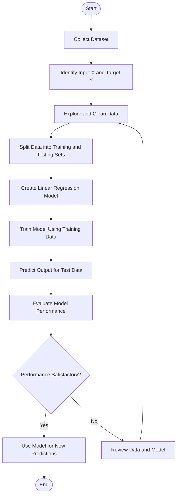

# 📈 Simple Linear Regression

## 📌 Introduction

Simple Linear Regression is a **Supervised Machine Learning algorithm** used to predict a continuous numerical value by finding the linear relationship between one independent variable and one dependent variable.

It fits a straight line to the given data to understand how changes in the input variable affect the output variable.

**Example:** Predicting a person's salary based on their years of experience.

## 🎯 Objective

* Understand the fundamentals of Simple Linear Regression.
* Learn how to calculate the best-fit line.
* Train a regression model using Python.
* Make predictions using new input values.
* Evaluate the model's performance.

## 🧮 Mathematical Formula

The equation of a simple linear regression line is:

$$
\hat{y} = mx + c
$$

Where:

* \(\hat{y}\) = Predicted output value
* \(x\) = Independent variable (input)
* \(m\) = Slope of the regression line
* \(c\) = Y-intercept

### Formula for Slope and Intercept

**Slope (m):**

$$
m = \frac{\sum (x_i-\bar{x})(y_i-\bar{y})}{\sum (x_i-\bar{x})^2}
$$

**Y-intercept (c):**

$$
c = \bar{y} - m\bar{x}
$$

Where:

* \(x_i, y_i\) = Individual data points
* \(\bar{x}\) = Mean of the input values
* \(\bar{y}\) = Mean of the output values

The algorithm finds the line that minimizes the **sum of squared differences between actual and predicted values**.

## 🔄 Workflow of Simple Linear Regression



## 🛠️ Technologies Used

* **Python** — Programming language
* **Pandas** — Data handling and manipulation
* **NumPy** — Numerical computations
* **Matplotlib** — Data visualization
* **Scikit-learn** — Machine Learning model implementation

## 📂 Project Structure

```text
Simple linear regresion/
│
├── README.md
├── Salary_dataset.csv
└── simple_linear_regression.py
```

*The filenames above are an example; adjust them to match your actual project files.*

## 📊 Model Evaluation

The model can be evaluated using the following metrics:

* **Mean Absolute Error (MAE):** Measures the average absolute prediction error.
* **Mean Squared Error (MSE):** Measures the average squared prediction error.
* **R² Score:** Measures how well the model explains the variation in the target variable.

## 📚 Key Learnings

* Difference between independent and dependent variables.
* Understanding the slope and intercept.
* How a best-fit line is calculated.
* Training and testing a regression model.
* Predicting continuous values.
* Evaluating regression performance.

## 🚀 Conclusion

Simple Linear Regression is a fundamental Machine Learning algorithm that helps us understand the relationship between two variables and make numerical predictions.

This project is one step in my Machine Learning journey. I will continue learning, practicing, and building more advanced models every day.

> **One step a day will eventually lead to bigger outputs! 🌱**
